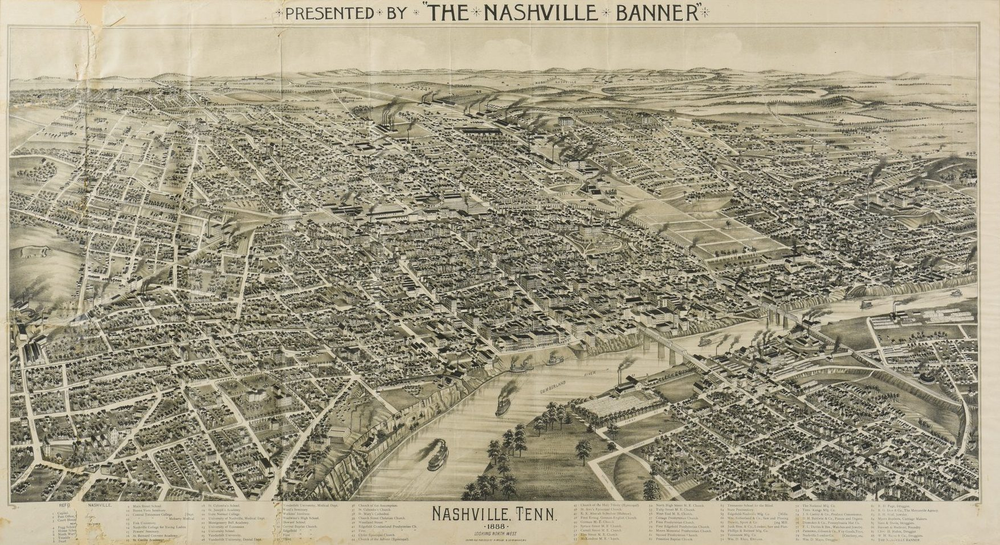
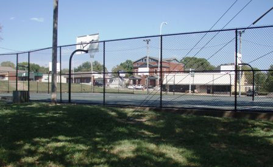

<html lang="en">
<head>
  <link href="https://fonts.googleapis.com/css2?family=EB+Garamond&display=swap" rel="stylesheet">
  <link rel="shortcut icon" type="image/png" href="favicon.ico?">

  <meta charset="UTF-8" />
  <meta name="viewport" content="width=device-width, initial-scale=1.0"/>
  <title>Nicc Forster-Benson</title>
  
</head>
<body>
   <!-- Top Bar -->
  
 Nicc Forster-Benson

  

    

      <a href="#about">About Me</a>
      <a href="https://nfb77.github.io/Files/CV_NFB.pdf" target="_blank">CV</a>
      <a href="#research">Research</a>
      <a href="#teaching">Teaching</a>
    

  

  

    <h1 id="about">Nicholas (Nicc) Forster-Benson</h1>
    
<strong>PhD Student, Sociology & Social Policy, Harvard University</strong>

    
<strong>Research Interests:</strong> Knowledge production and policy, political economy, financialization and inequality, mixed methods

    <h2>About Me</h2>
    
Nicc is an incoming Sociology & Social Policy PhD student at Harvard University. He received his BA in Economics and Quantitative Social Science (interdisciplinary) from Vanderbilt University in May of 2025. In his honors thesis, Nicc applied causal inference methods from econometrics, taking advantage of a quasi-experimental policy design to <a href="https://nfb77.github.io/Files/URTPN.pdf" target="_blank">estimate the effect of upzoning on housing prices</a> in Nashville.

    
    
Nicc has worked under the mentorship of both Dr. Karim Nchare (VU economics) and Dr. Richard Lloyd (VU sociology) navigating the complexities of formal economic modeling in relation to the socially-temporally contingent nature of economic phenomenon. In another strand of research, Nicc analyzed trade relationships between Portugal and its former African colonies from 1960–2022, providing <a href="https://papers.ssrn.com/sol3/papers.cfm?abstract_id=4874987" target="_blank">quantitative evidence for the persistence of colonial commodity dependence</a> and natural resource exploitation.

    
    
Raised and educated in Nashville, Tennessee, Nicc has also lived in Boston, Chicago, Milan, and Uppsala. In his spare time, he is a pick-up basketball enthusiast and part-time 3-point specialist.

    <h2 id="research">Research</h2>
    

      <a href="https://github.com/nfb77" target="_blank">GitHub</a> &nbsp;&nbsp; 
    

        
    
Currently, Nicc's research explores how the logics of financialization and globalization shape inequality, permeating housing, infrastructure, and public space. Focusing on the socio-political dynamics of contemporary urban governance, Nicc looks to investigate the evolving relationships between cities, markets, and policy.

    
    
With experience working for the Tennessee Department of Treasury, the U.S. Federal Reserve Board of Governors, and running for political office in Tennessee, Nicc is interested in bettering our understanding of the relations between state agents, knowledge production, governance, and inequality.

    <h2 id="teaching">Teaching</h2>
    <ul>
      <li><strong>ECON 1500 Economic Statistics, Teaching Assistant, Fall 2024</strong> 
        Vanderbilt University, Department of Economics — <a href="https://nfb77.github.io/Files/ECON1500Fall24.pdf" target="_blank">Syllabus</a> 
        Led weekly office hours and assisted in evaluation related to set theory, probability, random variables, and regression analysis.
      </li>
      <li><strong>SOC 3233 Contemporary American Society, Teaching Assistant, Fall 2022, Fall 2023</strong> 
        Vanderbilt University, Department of Sociology — <a href="https://nfb77.github.io/Files/SOC3233Fall23.pdf" target="_blank">Syllabus</a> 
        Key creation and essay evaluation regarding political, economic, and social changes in the U.S.
      </li>
      <li><strong>SOC 3202 Cultural Production and Institutions, Teaching Assistant, Fall 2023</strong> 
        Vanderbilt University, Department of Sociology — <a href="https://nfb77.github.io/Files/SOC3203Fall23.pdf" target="_blank">Syllabus</a> 
        Assisted in grading and instruction on the sociology of cultural production—from drill music to 15th-century Italian painting.
      </li>
    </ul>

    <h2 id="contact">Contact</h2>
    
📧 <a href="mailto:nforsterbenson@g.harvard.edu">nforsterbenson@g.harvard.edu</a>

    

      
    

  

</body>
</html>
