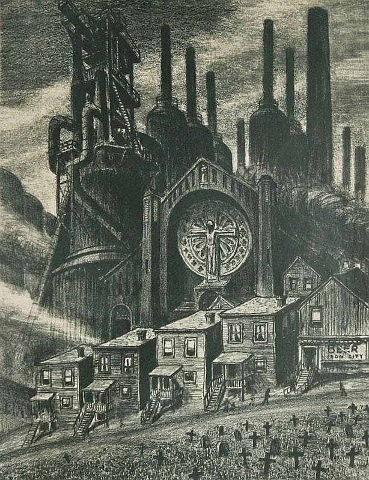
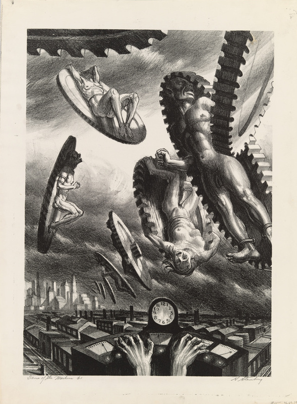

    
    
    

<a href="https://drive.google.com/file/d/1x0khmKX-Khnhw1tpvGOzUraXPIuiKe5Q/view?usp=sharing" target="_blank">CV</a> &nbsp;&nbsp;&nbsp;&nbsp; 
<a href="https://scholar.google.com/citations?user=kRAT0zUAAAAJ&hl=en" target="_blank">Google Scholar</a> &nbsp;&nbsp;&nbsp;&nbsp; 
<a href="https://github.com/nfb77" target="_blank">GitHub</a> &nbsp;&nbsp;&nbsp;&nbsp; 
<a href="https://linkedin.com/in/nicholas-forster-benson/" target="_blank">LinkedIn</a>

# Nicholas (Nicc) Forster-Benson

**PhD Student, Sociology & Social Policy, Harvard University**

**Research Interests:** Knowledge production and policy, political economy, financialization and inequality, mixed methods

## About Me
Nicc will receive his BA in Economics and Quantitative Social Science from Vanderbilt University in May of 2025. In his honors thesis, Nicc applied causal inference methods from econometrics, taking advantage of a quasi-experimental policy design to estimate the effect of upzoning on housing affordability in Nashville. Nicc’s findings demonstrated the regressive effects of upzoning on housing affordability, relating upzoning policies to the peripheralization of black communities in Nashville. Analyzing upzoning as a process of spatial financialization, his thesis draws upon the social production of space as a framework to understand post-Fordist modes of accumulation in Nashville.

Nicc has worked under the mentorship of both Dr. Richard Lloyd (VU sociology) and Karim Nchare (VU economics) navigating the complexities of formal economic modeling in relation to the socially-temporally contingent nature of economic phenomenon. In another strand of research, Nicc has applied insights into the social construction of political economy to topics of international development and legacies of colonialism in Africa, analyzing trade relationships between Portugal and its former African colonies from 1960-2022. Using gravity model Poisson pseudo-maximum-likelihood estimates of bilateral trade flows, Nicc’s research provided [quantitative evidence for the persistence of colonial commodity dependence](https://papers.ssrn.com/sol3/papers.cfm?abstract_id=4874987) and natural resource exploitation. His work combined empirical methodology with world-systems theory aiming to enhance our understanding of Africa’s unequal exchange in the new global division of labor, emphasizing the socio-political construction of modern economic inequalities.

With experience working for the Tennessee Department of Treasury, the U.S. Federal Reserve Board of Governors, and running for political office in Tennessee, Nicc aims to continue exploring the relations between state agents, knowledge production, and governance in graduate school. Currently, he is interested in examining how the logics of financialization and globalization shape inequality, permeating housing, infrastructure, and public space. Exploring the socio-political dynamics of contemporary urban governance, Nicc looks to investigate the evolving relationships between cities, markets, and policy.

Raised and educated in Nashville, Tennessee, Nicc has also lived in Boston, Chicago, Milan, and Uppsala, Sweden. In his spare time, he is a pick-up basketball enthusiast and part-time 3-point specialist.

## Contact
📧 [nicholas.o.forster-benson@vanderbilt.edu](mailto:nicholas.o.forster-benson@vanderbilt.edu)

    
    

