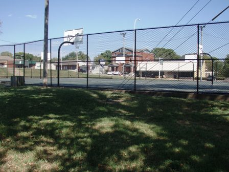

<html>
<head>
    <meta charset="UTF-8">
    <meta name="viewport" content="width=device-width, initial-scale=1.0">
    <title>Nicc Forster-Benson</title>
    
</head>
<body>
    
    

        <a href="#about">About</a>
        <a href="#research">Research</a>
        <a href="#teaching">Teaching</a>
        <a href="https://drive.google.com/file/d/1x0khmKX-Khnhw1tpvGOzUraXPIuiKe5Q/view?usp=sharing" target="_blank">CV</a> &nbsp;&nbsp;&nbsp;&nbsp; 
    

    

        

            
            
        

        

        <a href="#contact">Contact</a>
        <a href="https://scholar.google.com/citations?user=kRAT0zUAAAAJ&hl=en" target="_blank">Google Scholar</a> &nbsp;&nbsp;&nbsp;&nbsp; 
        <a href="https://github.com/nfb77" target="_blank">GitHub</a> &nbsp;&nbsp;&nbsp;&nbsp; 
        <a href="https://linkedin.com/in/nicholas-forster-benson/" target="_blank">LinkedIn</a>

        <h1 id="about">Nicholas (Nicc) Forster-Benson</h1>
        <strong>PhD Student, Sociology & Social Policy, Harvard University</strong>
        
<strong>Research Interests:</strong> Knowledge production and policy, political economy, financialization and inequality, mixed methods

        <h2>About Me</h2>
        
Nicc will receive his BA in Economics and Quantitative Social Science from Vanderbilt University in May of 2025...

        <h2 id="research">Research</h2>
        
Nicc has worked under the mentorship of both Dr. Richard Lloyd (VU sociology) and Karim Nchare (VU economics)...

        <h2 id="teaching">Teaching</h2>
        
Details about teaching experience will be added here.

        <h2 id="contact">Contact</h2>
        
📧 <a href="mailto:nicholas.o.forster-benson@vanderbilt.edu">nicholas.o.forster-benson@vanderbilt.edu</a>

        

        <h3>Additional Images:</h3>
        

            
            
            
        

    

</body>
</html>
