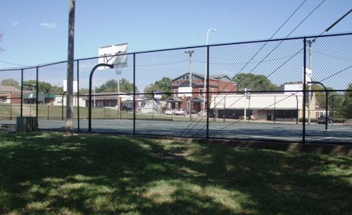
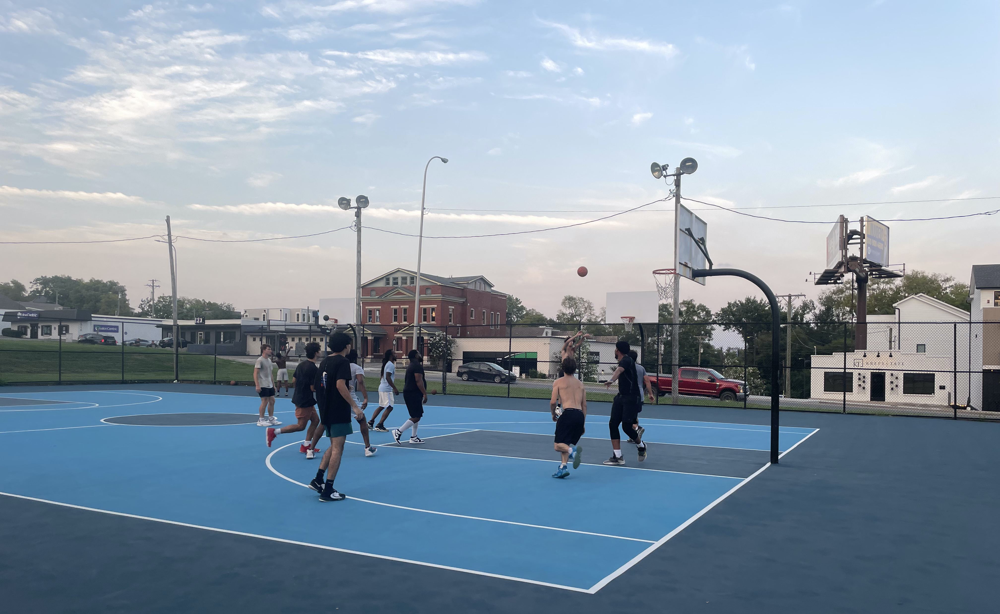

<html lang="en">
<head>
  <link href="https://fonts.googleapis.com/css2?family=EB+Garamond&display=swap" rel="stylesheet">
  <link rel="shortcut icon" type="image/png" href="favicon.ico?">
  <link rel="apple-touch-icon" sizes="180x180" href="/img/apple-touch-icon.png">
  <title>Nicholas Forster-Benson</title>
  

  
  <meta charset="UTF-8" />
  <meta name="viewport" content="width=device-width, initial-scale=1.0"/>
  <meta property="og:title" content="Nicholas Forster-Benson">

  
</head>

<body>
   <!-- Top Bar -->

  
 Nicholas Forster Benson   

  

    

      <a href="#research">Research</a>
      <a href="#teaching">Teaching</a>
      <a href="https://nfb77.github.io/Files/CV_NFB.pdf" target="_blank">CV</a>

    

    

    

    

    <h2 id="about">Bio</h2>

    

    
   
    

         
      
<strong><a href="https://sociology.fas.harvard.edu/people/nicholas-forster-benson" class="plain-link" >PhD Student</a></strong>, <a href="https://gsas.harvard.edu/program/social-policy" class="plain-link" target="_blank">Sociology & Social Policy</a>  
    <strong>Research Interests</strong>: Political economy, markets and inequality, financialization, quantatitive methods 

    

  <a href="https://github.com/nfb77" target="_blank" class="contact-box">
     GitHub
  </a>

  <a href="mailto:nforsterbenson@g.harvard.edu" class="contact-box">
     E-mail
  </a>

  

        
I am a doctoral student in <a href="https://www.hks.harvard.edu/educational-programs/doctoral-programs/phd-social-policy" target="_blank">Sociology & Social Policy</a> and Malcolm H. Wiener Scholar in Poverty and Justice at Harvard University. Broadly, my research asks how material inequalities are produced, reproduced, or mitigated through various economic and political institutions. My current focus is U.S. housing markets, examining the intersection of local politics, financialization, and inequality. Currently, my research focuses on U.S. housing markets, examining the intersection of local politics, financialization, and inequality.

        <!-- 
Currently, my research focuses on U.S. housing markets, examining the intersection of local politics, financialization, and inequality. Another strand of my work focuses on underdevelopment, utilizing nation-level heterogeneity in trade flows and macro-economic indicators to better understand post-colonial commodity dependence and natural resource exploitation in the global south.
 -->

          
I hold a BA in <a href="https://as.vanderbilt.edu/economics/major-minor/"  target="_blank">Economics</a> and <a href="https://nfb77.github.io/Files/requirements-individually-designed-interdisciplinary-major.pdf" target="_blank">Quantitative Social Science</a> (<a href="https://as.vanderbilt.edu/internal/policies/individually-designed-interdisciplinary-major.php" class="plain-link" target="_blank">interdisciplinary</a>) from <a href="https://www.vanderbilt.edu/" class="plain-link" target="_blank">Vanderbilt University</a>. I am a lifelong Tennessean, but I have also lived briefly lived in Uppsala, Chicago, Milan, and Boston. In my spare time, I am a <a href="https://en.wikipedia.org/wiki/Pick-up_basketball"  target="_blank">pick-up basketball</a> enthusiest.
   
          
  

  

  

  

  <h2 id="research">Research</h2>

  <h3>Publications</h3>

  

    <strong>N. Forster-Benson</strong> and K. Nchare. (2025).
    “<a href="https://doi.org/10.1016/j.jhe.2025.102104" target="_blank">Upzoning and Residential Transaction Price in Nashville.</a>”
    <em>Journal of Housing Economics</em>, 70: 102104.
  
  

  <h3>Works in Progress</h3>

  

   <strong>N. Forster-Benson</strong>.
    “<a href="https://nfb77.github.io/Files/CODRUS.pdf" target="_blank">Corporate Ownership Density and Rent in the United States: An Analysis from 2012-2022.</a>”
    Working paper. 
  

    <strong>N. Forster-Benson</strong>. “Upzoning, Density, and the Financialization of Space in Nashville.” Under Review. 

  

    <strong>N. Forster-Benson</strong>. “Towards a Relational Understanding of Zoning Conflict.” In Preperation.

    <strong>N. Forster-Benson</strong> and K. Nchare.
    “<a href="https://doi.org/10.2139/ssrn.4874987" target="_blank">Trade Distortions and Colonial Legacy: Evidence from Portugal and Its Former Colonies.</a>”
    Revise &amp; Resubmit, <em>Journal of International Development</em>.

  

 

  

    

    
    <h2 id="teaching">Teaching</h2>
    <ul>
      <li><strong>Economic Statistics (ECON 1500), Teaching Assistant, Fall 2024</strong> 
        Vanderbilt University, Department of Economics — <a href="https://nfb77.github.io/Files/ECON1500Fall24.pdf" target="_blank">Syllabus</a> 
        Introduction to probability and inference.
      </li>
      <li><strong>Contemporary American Society (SOC 3233), Teaching Assistant, Fall 2022, Fall 2023</strong> 
        Vanderbilt University, Department of Sociology — <a href="https://nfb77.github.io/Files/SOC3233Fall23.pdf" target="_blank">Syllabus</a> 
         Changes in political economy, geography, and social class stratification in the United States (1940s-present).
      </li>
      <li><strong>Cultural Production and Institutions (SOC 3202), Teaching Assistant, Fall 2023</strong> 
        Vanderbilt University, Department of Sociology — <a href="https://nfb77.github.io/Files/SOC3203Fall23.pdf" target="_blank">Syllabus</a> 
        Examining the production of art and authenticity within various art fields, from the production of drill music to 15th-century Italian painting.

      </li>
    </ul>

  
  

  

    

    <h2 id="contact">Contact</h2>
    
✉ <a href="mailto:nforsterbenson@fas.harvard.edu">nforsterbenson@fas.harvard.edu</a>

    
⟟ <a href="https://www.google.com/maps/dir//808-818+Argyle+Ave,+Nashville,+TN+37203/@36.1364026,-86.7800109,214m/data=!3m1!1e3!4m9!4m8!1m0!1m5!1m1!1s0x8864667ef84ee215:0xecc27dbc7936315d!2m2!1d-86.7793274!2d36.1364026!3e0?entry=ttu&g_ep=EgoyMDI1MDYyOS4wIKXMDSoASAFQAw%3D%3D"  target="_blank">Reservoir Park Courts, 1801 8th Ave South, Nashville, TN 37203</a>

      

  

</body>
</html>
